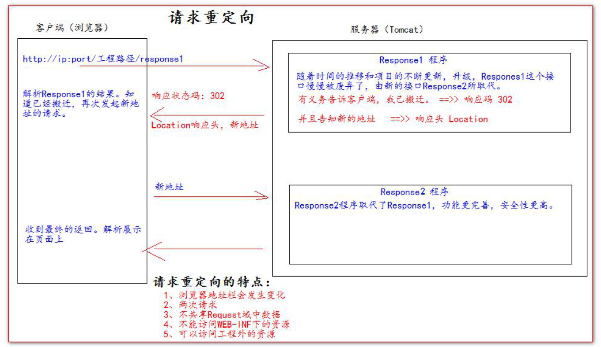

## HttpServletResponse类

HttpServletResponse 类和HttpServletRequest 类一样。每次请求进来，Tomcat 服务器都会创建一个Response 对象传递给Servlet 程序去使用。HttpServletRequest 表示请求过来的信息，HttpServletResponse 表示所有响应的信息，我们如果需要设置返回给客户端的信息，都可以通过HttpServletResponse 对象来进行设置

### 1.1 两个输出流

- 字节流`getOutputStream(); `常用于下载（传递二进制数据）
- 字符流`getWriter();` 常用于回传字符串（常用）

两个流同时只能使用一个。使用了字节流，就不能再使用字符流，反之亦然，否则就会报错。

## 1.2 往客户端回传数据

~~~java
public class ResponseIOServlet extends HttpServlet {
    @Override
    protected void doGet(HttpServletRequest req, HttpServletResponse resp) throws ServletException,
    IOException {
        // 解决响应中文乱码方案
       	resp.setContentType("text/html; charset=UTF-8");
    	// 往客户端回传字符串数据。
        PrintWriter writer = resp.getWriter();
        writer.write("response's content!!!");
    }
}
~~~

## 请求重定向

请求重定向，是指客户端给服务器发请求，然后服务器告诉客户端说。我给你一些地址。你去新地址访问。叫请求重定向（因为之前的地址可能已经被废弃）。

~~~java
resp.sendRedirect("http://localhost:8080");
~~~

