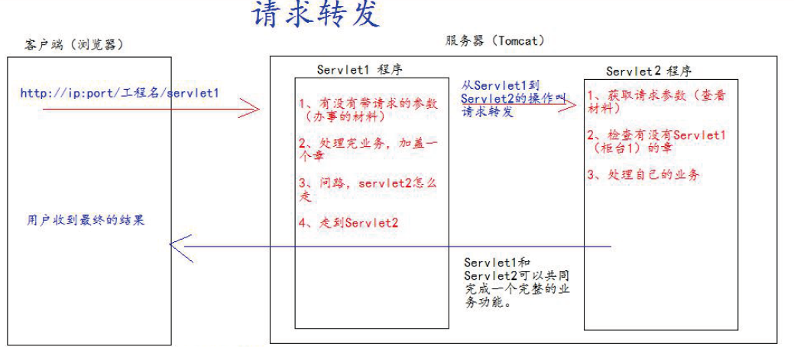

## 请求的转发

请求转发是指，服务器收到请求后，从一次资源跳转到另一个资源的操作叫请求转发。

- 浏览器地址栏没有变化
- 他们是一次请求
- 他们共享Request域中的数据
- 可以转发到WEB-INF目录下
- 不可以访问工程以外的资源

~~~java
public class Servlet1 extends HttpServlet {
    @Override
    protected void doGet(HttpServletRequest req, HttpServletResponse resp) throws ServletException,
    IOException {
        // 获取请求的参数查看
        String username = req.getParameter("username");
        System.out.println(username);
        req.setAttribute("key1","psw1");

        /**
        * 请求转发必须要以斜杠打头，/ 斜杠表示地址为：http://ip:port/工程名/ , 映射到IDEA 代码的web 目录
        */
        RequestDispatcher requestDispatcher = req.getRequestDispatcher("/servlet2");
        requestDispatcher.forward(req,resp);
	}
}
~~~

~~~java
public class Servlet2 extends HttpServlet {
    @Override
    protected void doGet(HttpServletRequest req, HttpServletResponse resp) throws ServletException,
    IOException {
        // 获取请求的参数查看
        String username = req.getParameter("username");
        System.out.println(username);
        Object key1 = req.getAttribute("key1");
        System.out.println(key1);
        
        ........
    }
}
~~~

